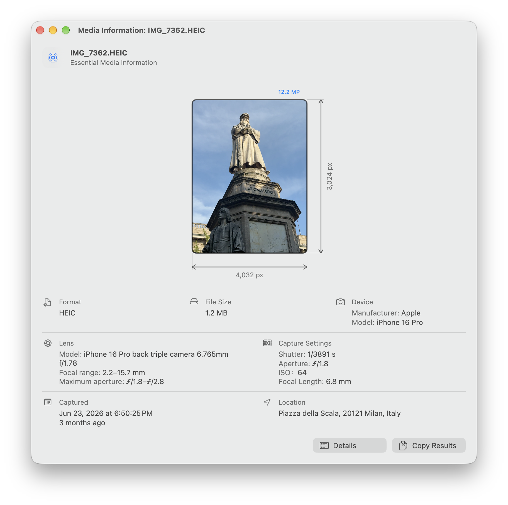
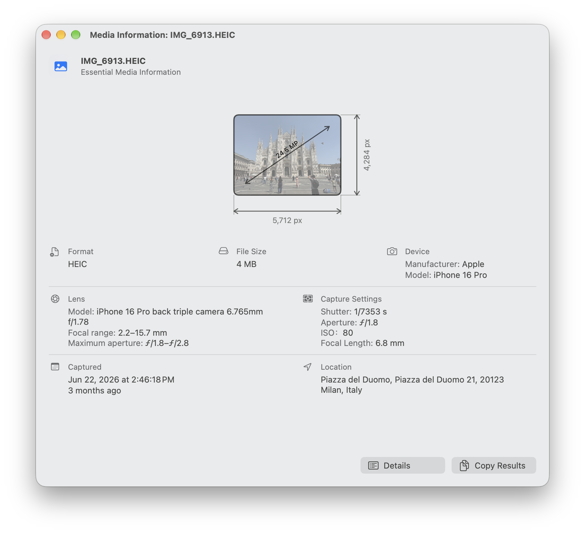
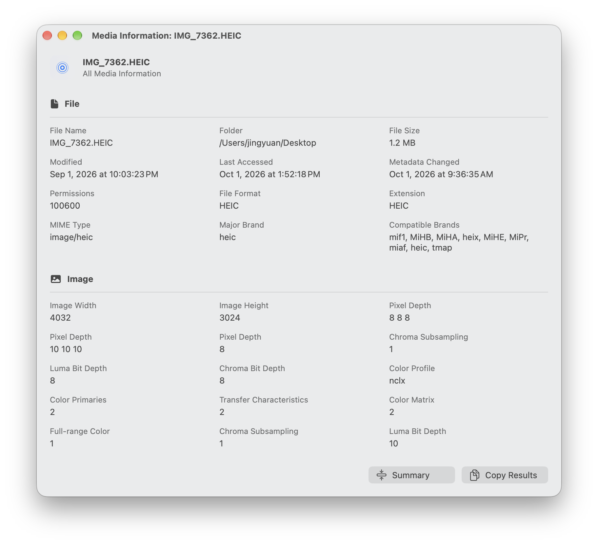
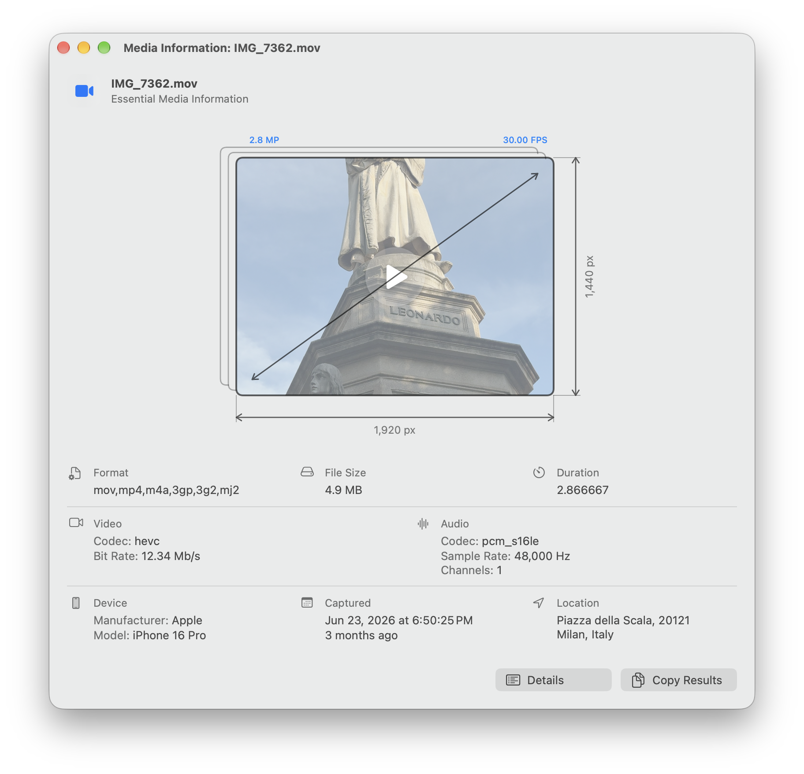
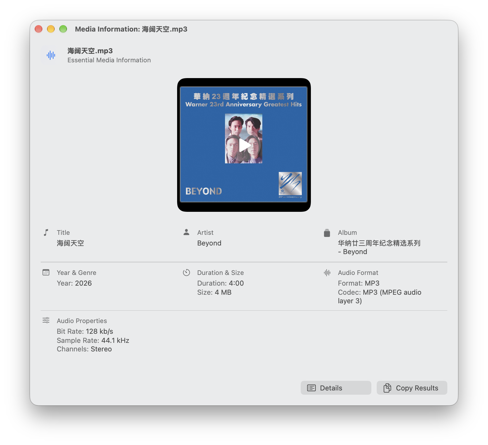

# View Media Info（媒体信息查看器）

View Media Info 是一款原生 macOS App，用来快速查看照片、视频、音频和动态照片中的实用信息。可从 Finder 直接打开文件，也可在 App 中选择文件，查看格式、尺寸、日期、相机或录音设备、位置以及其他可用的元数据；不会修改文件。

[English README](README.md) · [项目主页](https://jingyuan-zheng.github.io) · [源码](https://github.com/Jingyuan-Zheng/View-Media-Info)



## 安装与开始使用

View Media Info 需要 macOS 26 或更高版本。

### 安装 App

1. 从项目的 Releases 页面下载 `Media Information-<版本>.dmg`。
2. 打开 DMG，将 **View Media Info** 拖入 **应用程序**。
3. 打开 **View Media Info**，选择 **文件 → 打开媒体…** 或按 `⌘O`，然后选择照片、视频或音频文件。

本 App 只读取信息，不会编辑、重命名、上传或向媒体文件写回元数据。

### 从 Finder 使用

可选的 Finder 快捷操作让你无需先打开 App，直接查看已选文件。

1. 下载并解压 `View Media Data Quick Action-<版本>.zip`。
2. 双击 **View Media Data.workflow**，然后选择 **安装**。
3. 在 Finder 中按住 Control 点按媒体文件，选择 **快捷操作 → View Media Data**。

快捷操作内含独立的 App 副本，安装在 `~/Library/Services`，与“应用程序”中的 App 相互独立。

### 查看、预览与复制信息

- 首个界面显示关键信息；选择 **详细信息** 可查看完整元数据。
- 选择 **复制结果**，即可复制当前显示的信息。
- 按空格键可打开或关闭 macOS Quick Look；双击图片或动态照片预览可在其中打开。
- 视频和音频封面在可预览时会显示播放按钮。
- 动态照片显示 HEIC 照片本身的尺寸，同时按正确方向播放配套视频。

### 调整设置

选择 **媒体信息 → 设置…** 可改为中文或英文。语言会在下次打开 App 时生效；日期和时间则遵循 Mac 的地区设置。

若 macOS 在首次启动时阻止 App 或工作流，请按住 Control 点按它，选择 **打开**，再确认提示。Release 使用 ad-hoc 签名，未进行公证。

## 示例

### 照片与动态照片





### 视频



### 音频



## 可查看的信息

- 照片：格式、文件大小、存储像素尺寸、像素数、相机、镜头、曝光、拍摄时间和位置（若有）。
- 动态照片：照片信息加上循环播放的配套视频预览；支持 Apple 及常见 Android 动态照片标记。
- 视频：尺寸、帧率、时长、编码、码率、音频流、设备、日期和位置（若有）。
- 音频：封面、标题、艺术家、专辑、年份、流派、时长、格式、编码、码率、采样率和声道数。

文件选择器可选择图片、视频和音频。实际可读取的格式取决于 macOS 及已安装的信息读取工具；常见 HEIC、JPEG、PNG、MOV、MP4、MP3、M4A、FLAC、WAV、AIFF 等格式都已支持。

## 运行要求与信息读取工具

- **ExifTool** 是读取图片和音频元数据所必需的工具。App 会在 `/opt/homebrew/bin`、`/usr/local/bin`、`/usr/bin` 中查找它。
- **ffprobe** 不是必需，但可提供更完整的视频和音频流信息。App 会在 `/opt/homebrew/bin` 和 `/usr/local/bin` 中查找它。

如果你使用 Homebrew，可一次安装两者：

```sh
brew install exiftool ffmpeg
```

位置名称仅会在需要时通过 Apple 系统服务解析；无法查询时，App 会显示原始坐标。

## 关于

在 **媒体信息 → 关于媒体信息** 中可打开原生 macOS About 面板，查看 App 图标和版本，以及作者、项目主页、源码仓库和 MIT 许可证链接。

## 构建与发布

无需 Xcode，即可构建独立 App：

```sh
./build_app.sh
```

脚本会以 `STANDALONE_MEDIA_INFO` 编译、进行本地 ad-hoc 签名与验证，并写出 `build/View Media Info.app.zip`。

将 [Dmg Maker](../Dmg%20Maker) 放在本仓库同级目录后，可生成两种发布文件：

```sh
./scripts/package_release.sh
```

它会在 `release/` 中生成由 Dmg Maker 打包的独立 App DMG，以及包含可安装 Finder 快捷操作的 ZIP。

## 项目结构

- `Sources/ViewMediaInfo/main.swift`：应用源码。
- `Resources/`：App 图标与菜单本地化资源。
- `Info.plist`：包信息。
- `build_app.sh`：独立构建脚本。
- `Workflow/`：Finder 快捷操作模板；打包时加入已编译的 App。
- `scripts/package_release.sh`：发布打包脚本。

信息通过 ExifTool、ffprobe、ImageIO、AVFoundation、Quick Look、Core Location 和 MapKit 读取。所有解析均为只读；仅对异常旧编码元数据文本进行针对性恢复。

## 许可证

本项目使用 [MIT 许可证](LICENSE)。
